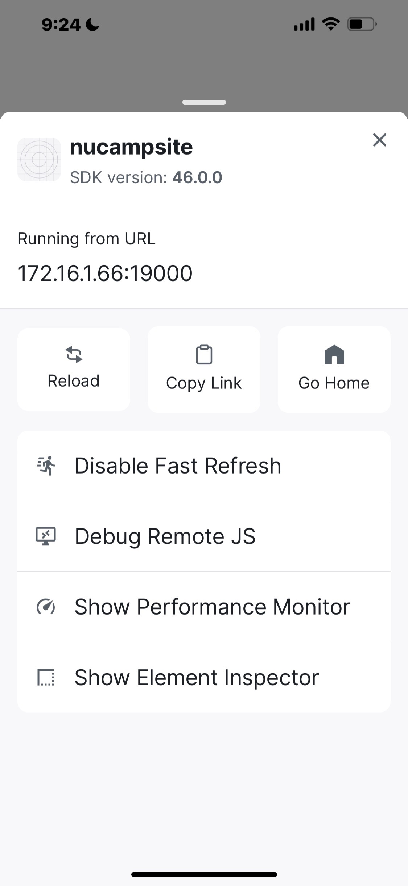
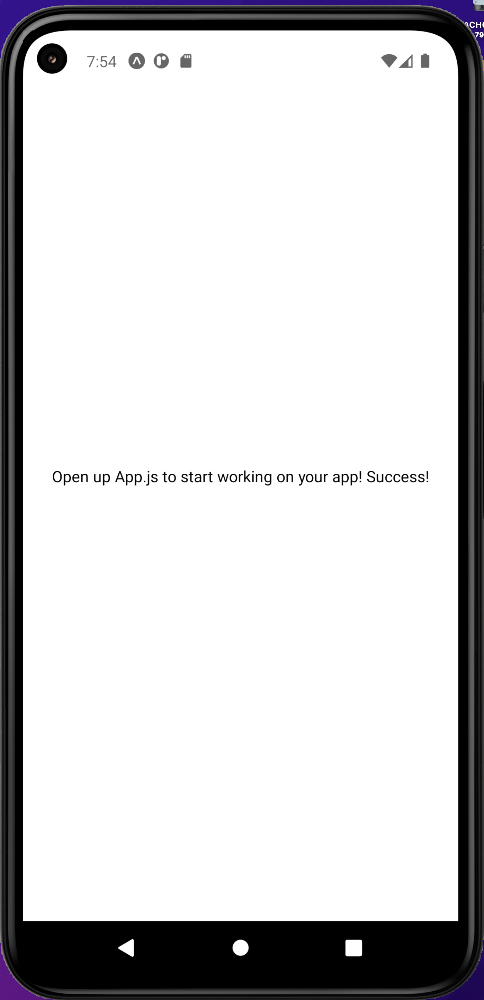
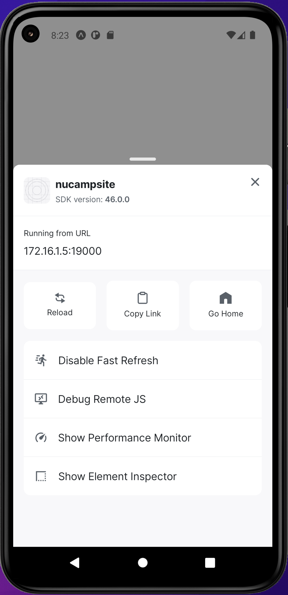
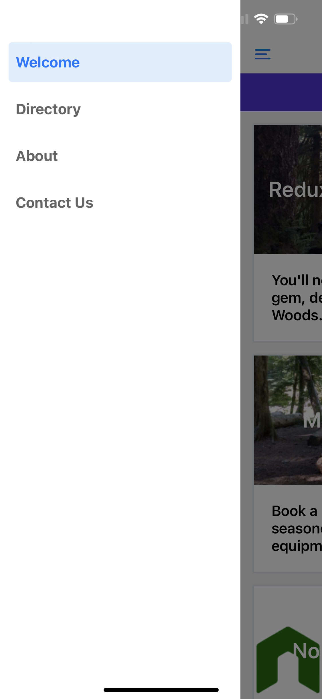
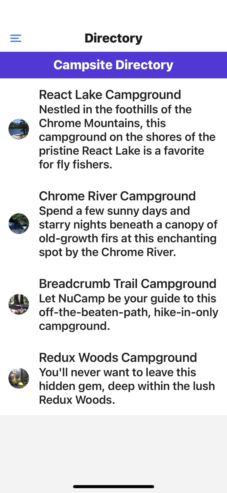
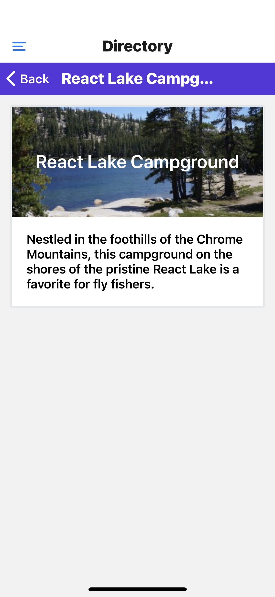
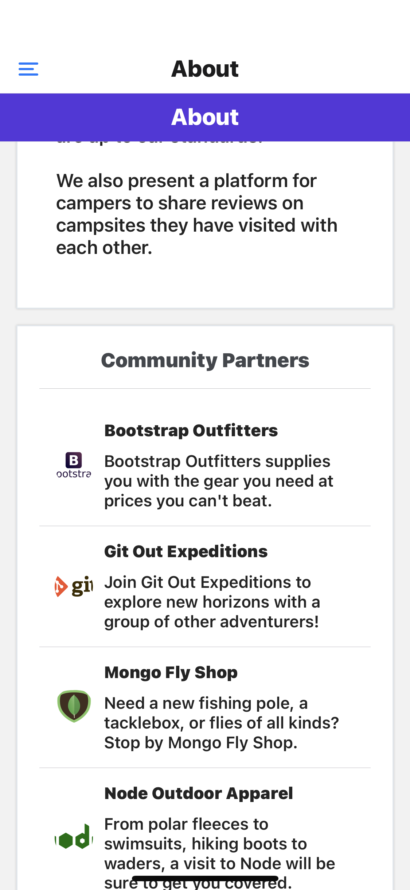
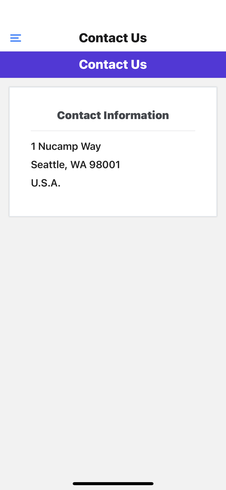

# Nucamp Bootcamp - REACT Native Campsite App
 Mobile App Development

---
## Week-01
> Environment Setup
>- brew install watchman
>- Add the .nosync extension to the reactnative folder (prevents iCloud auto sync)
>- From terminal: npx create-expo-app
>- To run the project, cd to the folder then type:

```
- npm start: will compile the application or:
- npm run android
- npm run ios
- npm run web
```

### npm Start:
› Metro waiting on exp://172.16.1.66:19000
› Scan the QR code above with Expo Go (Android) or the Camera app (iOS)

› Press a │ open Android
› Press i │ open iOS simulator
› Press w │ open web

› Press j │ open debugger
› Press r │ reload app
› Press m │ toggle menu

› Press ? │ show all commands

› Press Ctrl-C to quit

### Update Locked Versions

>- From the terminal: npm install expo@46.0.13 expo-status-bar@1.4.0 react@18.0.0 react-native@0.69.6

### Install Android Virtual Device (AVD)
> NOTE: AVD is process intensive. May require alternative such
> (Run app on mobile device)[https://learn.nucamp.co/mod/book/view.php?id=6244&chapterid=6534]
> - Needs:
> - Download for Android from the Play Store (Android 5.0+)
    Download for iOS from the App Store. (iOS 12.0+)

- Device must be on same network as computer
- npm start from the app directory
- Scan the QR code provided

### IOS/Android Notes
> NOTE: Shake phone to load options screen.
> - Consider (downloading Android Studio)[https://developer.android.com/studio?gclsrc=aw.ds&gclsrc=ds&gclsrc=aw.ds#downloads]
- Open Android Studio:
- More Actions > Virtual Device Manager
- Start AVD by pressing play button

> From terminal: npx expo start  








> NOTE: The most consistent method for loading on devices is to use the QR Code scanned via Expo Go App.

### React Native Resources
[React Native Elements](https://reactnativeelements.com/docs/3.4.2/getting_started)

> npm install react-native-elements

[Stylesheet](https://reactnative.dev/docs/stylesheet)

[Core Components & APIs](https://reactnative.dev/docs/components-and-apis )


### Command Line Tools

npx expo -h | List all commands available
npx expo -c | Clear cache

Usage
$ npx expo <command>

Commands
start, export, export:web
run:ios, run:android, prebuild
install, customize, config
login, logout, whoami, register

Options
--version, -v   Version number
--help, -h      Usage info

For more info run a command with the --help flag
$ npx expo start --help

### Assignment: Adding Images and Campsite Data








---
## Week-02


## Week-03


## Week-04


## Week-05


---
## NOTES FROM REACT Course

### Added json-server
Activities for this week are dependent on the json-server. The
server must be installed and running for the activities to work.

**To run the json-server use:**
json-server -H 0.0.0.0 --watch db.json -p 3001 -d 2000

**NOTE:**
TODO: Try typing s + to see what this does.

>  Type s + enter at any time to create a snapshot of the database

### Update NPM 8.19.2 -> 9.1.3
Terminal: npm i -g npm@9.1.3

### Watchman error Fix
Not sure why this occurred but now npm start has no errors
> From terminal:
> - watchman watch-del '/Users/mach3-dtserv/Nucamp---REACTNative.nosync' ; watchman watch-project '/Users/mach3-dtserv/Nucamp---REACTNative.nosync'
